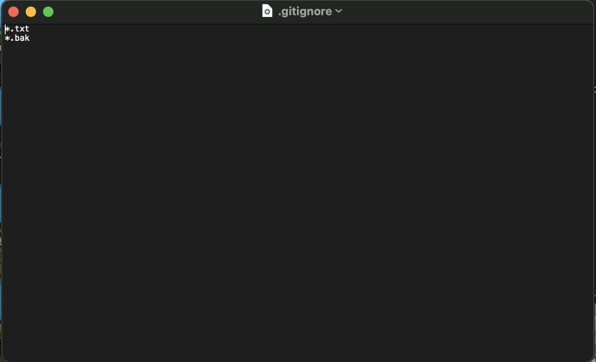
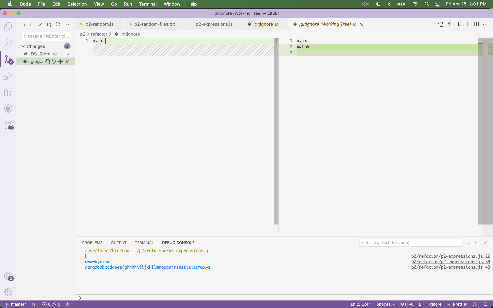

# Project 2

[RETURN TO HOMEPAGE](https://sierrabakerr.github.io/)

## Learning Objectives:

### After completing this project, you will:

Gain experience using git via your CLI and Visual Studio Code (VSCode) Source Control

Gain experience writing and executing non-web server Node.js JavaScript code

Practice refactoring JavaScript code

## Overview:

### Project elements:

Use the command line interface (CLI) of your operating system to create and work with a git repository (repo)

Refactor the JavaScript program from the previous project to practice using git and practice refactoring

Use git via VSCode

Create and use a .gitignore file

Diff split screen

## Project Deliverables:

### 1. [p2-random.js](p2-random.js)

### 2. [p2-random-files.txt](p2-random-files.txt)

### 3. [p2-random-commits.txt](p2-random-commits.txt)

### 4. [p2-expressions.js](p2-expressions.js)

### 5. refactor/.gitignore (screenshot)

### 6. p2-vscode-diff.png

